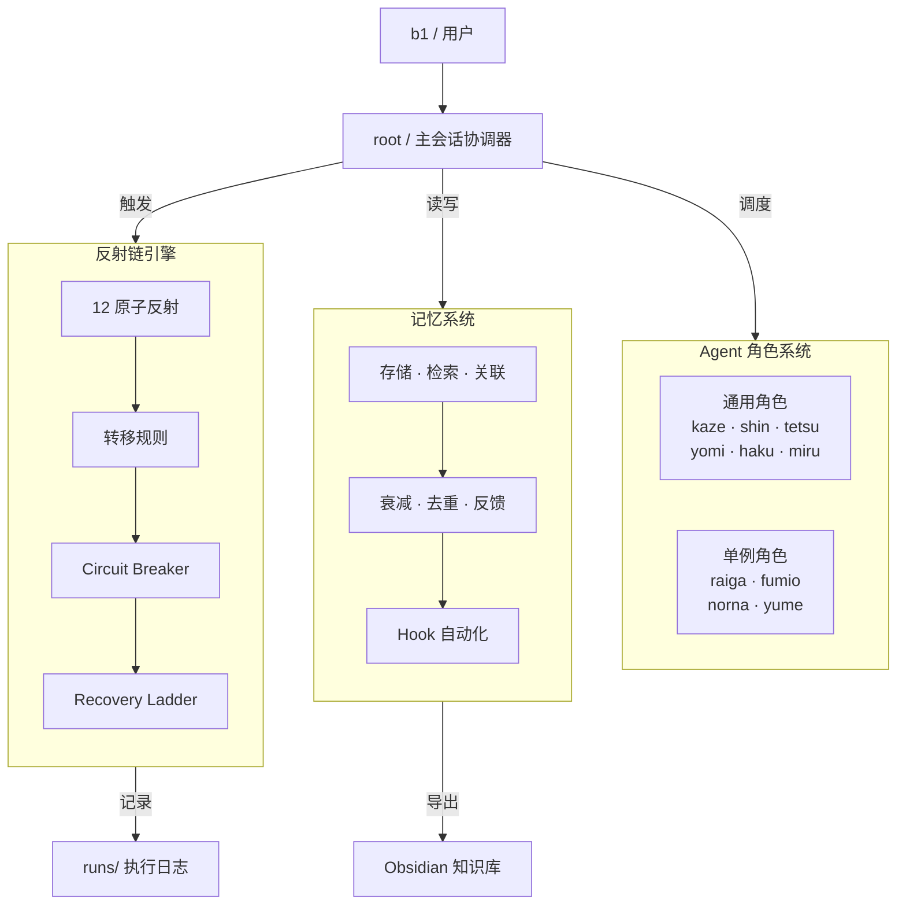

# Subagent Memory System

基于 BM25 + 三维评分的 Claude Code 多 Agent 协作记忆系统。管理 12 个 subagent 的任务记忆、反射链调度和知识提炼。

## 系统架构



## 目录结构

```
~/mem/mem/
├── agents/                  # Agent 记忆存储（按 Type/name 分组）
├── root/                    # root 协调器的决策记忆和反馈
├── runs/                    # 反射链执行记录（workflow runs）
├── workflows/               # 触发地图 + 模板 + 执行统计
├── skills/                  # 内置 skill（agent-memory / reflex-audit / reflex-fuzz）
├── scripts/                 # 核心 Python 模块（CLI · 检索 · 衰减 · 反馈等）
├── tests/                   # 测试套件（30 个测试文件）
├── docs/                    # 架构文档和设计计划
├── templates/               # 工作流模板（YAML）
├── trigger-map.md           # 反射系统权威触发地图
├── trigger-stats.json       # 反射统计 + Circuit Breaker 状态
├── reflex-config.json       # Agent → 反射映射配置
├── post-agent-trigger-stats.py   # Hook: Agent 完成后更新触发统计
├── post-memory-consolidate-hook.py  # Hook: Agent 完成后触发记忆整合
├── pre-agent-cb-check.py    # Hook: Agent 启动前检查 Circuit Breaker
├── SKILL.md                 # agent-memory skill 定义
└── CLAUDE.md                # 仓库级 Claude Code 配置
```

## 角色系统

### 通用角色

| 角色 | 类型 | 职责 | 权限 |
|------|------|------|------|
| kaze（风者） | Explore | 代码探索、文件搜索 | 只读 |
| shin（審者） | Auditor | 代码审计、红队攻击 | 只读 |
| tetsu（鉄者） | Worker | 代码实现、bug 修复 | 读写 |
| yomi（読者） | Analyst | 外部调研、技术分析 | 只读 + Web |
| haku（白者） | Inspector | 验证测试、对抗验证 | 只读 + lint/test |
| miru（監者） | Watcher | root 行为合规审计 | 只读 |

### 单例角色

| 角色 | 代号 | 职责 |
|------|------|------|
| 吞食者 | raiga | 消化文档/书籍 → 产出 skill 和约束 |
| 织者 | fumio | 管理项目文档和知识库 |
| 母体 | norna | 创建/销毁 subagent 角色 |
| 梦者 | yume | 管理全局记忆系统 |

### 动态角色（母体创建）

Worker 池中的 Aspen、Ember 等角色由 norna 按需创建，反馈过差时触发消亡流程。

## 反射系统

### 12 个原子反射

| 反射 | Agent | 类型 | 说明 |
|------|-------|------|------|
| 调研 | yomi | 普通 | L0-L3 分级调研 |
| 探索 | kaze | 普通 | 代码结构和文件搜索 |
| 实现 | tetsu | 普通 | 代码变更执行 |
| 文档 | fumio | 普通 | 文档编写和更新 |
| 审计 | shin | 普通 | 红队审计 + DA 质疑 |
| 验证 | haku | 普通 | 对抗性验证测试 |
| 提交 | tetsu | 枢纽 | git commit/push |
| 日记 | fumio | 终端 | 每日工作日报 |
| 记忆 | yume | 终端 | 记忆归档 |
| 吞食 | raiga | 普通 | 知识提炼 |
| 定义 | norna | 普通 | 角色生命周期 |
| root审计 | miru | 终端 | root 合规检查 |

### 转移规则

反射间通过输出条件自动转移。典型路径：`调研 → 探索 → 实现+文档 → 审计 → 提交 → 日记+记忆`。失败统一进入 Recovery Ladder（L1 重试 → L2 换角色 → L3 降级 → L4 上报）。

### 对抗性协议

- **L0 轻量**：标准审计 + 基础验证
- **L1 标准**：红队攻击 + 模糊输入
- **L2 强对抗**：Devil's Advocate 质疑 + 全对抗验证 + Severity x Likelihood 风险矩阵
- **L3 竞争假设**：yomi x3 并行调研 + shin DA + Council Debate / Attack Trees / Pre-mortem

Circuit Breaker 防止连续失败：CLOSED →(3 连败)→ OPEN →(24h)→ HALF-OPEN →(2 连胜)→ CLOSED。

## Skills

| Skill | 路径 | 用途 |
|-------|------|------|
| agent-memory | `skills/agent-memory/` | 核心记忆引擎：存储、检索、关联、衰减、反馈学习 |
| reflex-audit | `skills/reflex-audit/` | 反射系统审计：收集触发统计 + 分析反射链健康度 |
| reflex-fuzz | `skills/reflex-fuzz/` | 反射系统模糊测试：探索边界场景 + 生成测试报告 |

## Hook 脚本

| 脚本 | 行数 | 触发时机 | 功能 |
|------|------|----------|------|
| `post-agent-trigger-stats.py` | 663 | Agent 完成后 | 更新触发统计、Circuit Breaker 状态机、并行批次管理 |
| `post-memory-consolidate-hook.py` | 298 | Agent 完成后 | 自动记忆整合（去重 + 衰减 + 索引更新） |
| `pre-agent-cb-check.py` | 256 | Agent 启动前 | 检查 Circuit Breaker 状态，OPEN 时拦截或降级 |

## 核心模块

```
scripts/
├── cli.py              # 命令行入口（retrieve/add/feedback/health-check 等）
├── memory_store.py     # Memory dataclass + 文件存储层
├── retriever.py        # BM25 + 扩散激活 + 三维评分检索
├── associator.py       # 共现分析 + 语义相似度关联
├── extractor.py        # 任务描述 → 结构化记忆提取
├── inject.py           # Agent prompt 记忆注入
├── evolver.py          # LLM 驱动的记忆邻居演化
├── consolidator.py     # Jaccard 相似度去重合并（阈值 0.85）
├── decay_engine.py     # Ebbinghaus 遗忘曲线衰减 R=e^(-t/S)
├── feedback_loop.py    # 自动推断 + 渐进式升级（降权→告警→阻断）
├── trigger_tracker.py  # 触发效率追踪与自动阈值调整
├── obsidian_export.py  # 导出为 Obsidian 笔记/MOC/Mermaid 图
├── registry.py         # Agent 角色注册表管理
└── distiller.py        # 知识蒸馏引擎
```

## 使用方式

### 安装

本系统作为 Claude Code skill 运行，无需独立安装：

```bash
# 确保 Python 3.10+ 可用
python3 --version

# 运行测试验证环境
cd ~/mem/mem/skills/agent-memory && python3 -m pytest tests/ -v
```

### CLI 快速上手

```bash
# 添加记忆
python3 scripts/cli.py --agent tetsu --store ~/mem/mem/agents/Worker/tetsu \
  quick-add --name "修复登录" --description "修复 OAuth 回调" \
  --type task --keywords "auth,oauth,fix" "详细内容..."

# 检索记忆
python3 scripts/cli.py --agent tetsu --store ~/mem/mem/agents/Worker/tetsu \
  retrieve "OAuth" --top-k 5

# 跨 Agent 检索
python3 scripts/cli.py retrieve "OAuth" --cross-agent --top-k 3

# 健康检查
python3 scripts/cli.py --agent tetsu --store ~/mem/mem/agents/Worker/tetsu \
  dashboard
```

### 配置

- `reflex-config.json` — Agent 到反射的映射
- `trigger-stats.json` — 反射统计和 Circuit Breaker 状态
- `~/.claude/settings.json` — Hook 注册（PostToolUse/Agent 触发）

## 许可证

MIT
