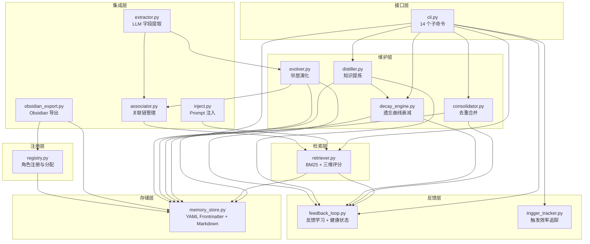
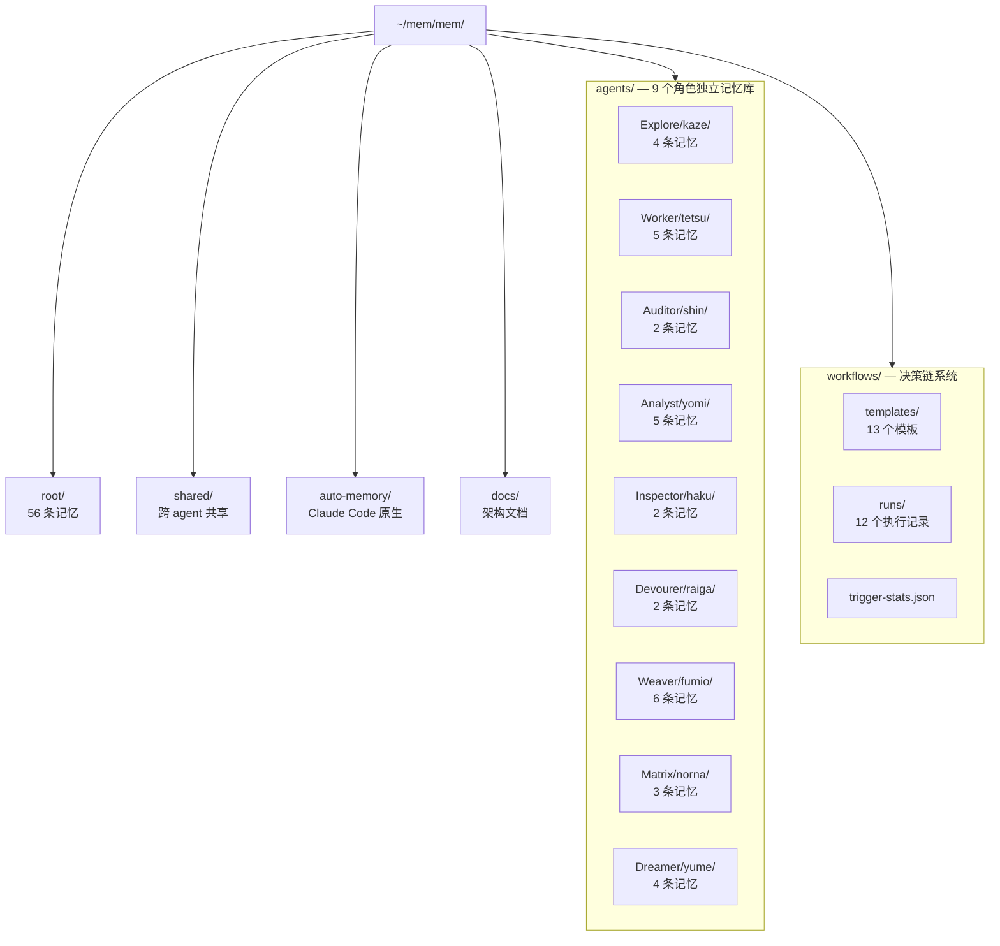
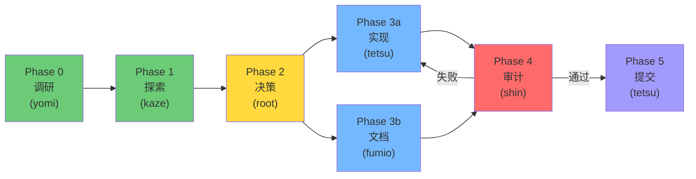
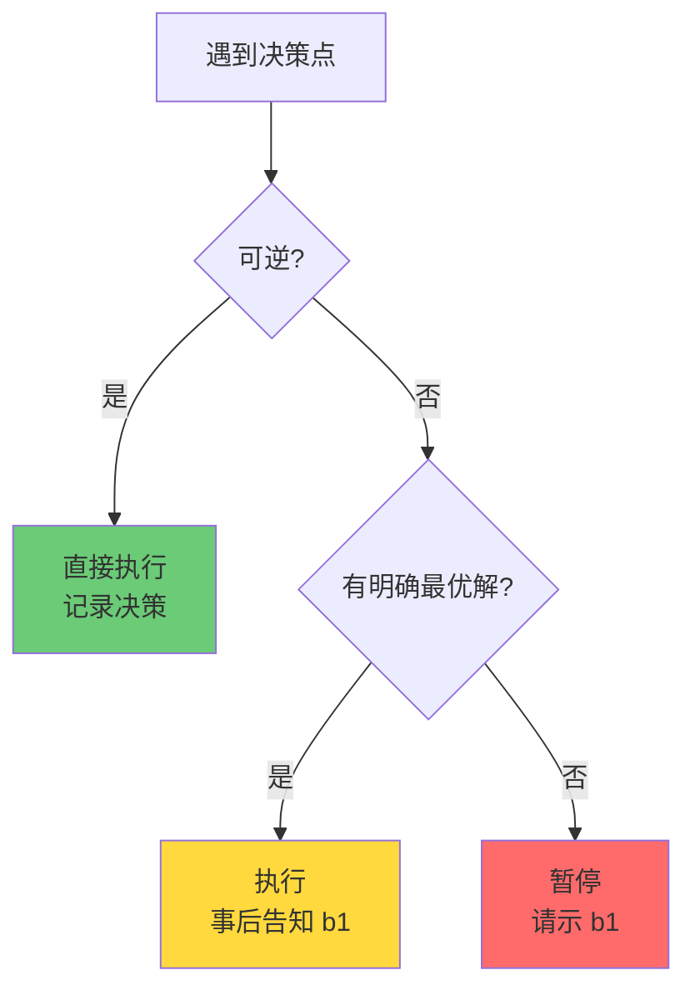
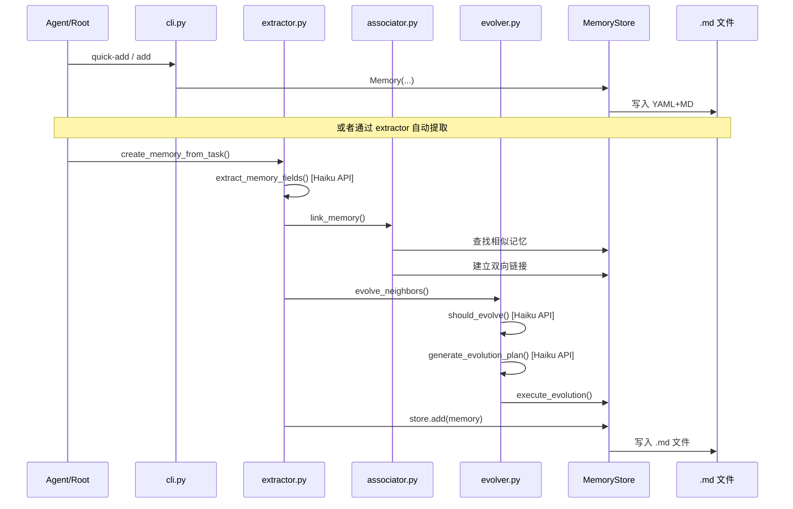
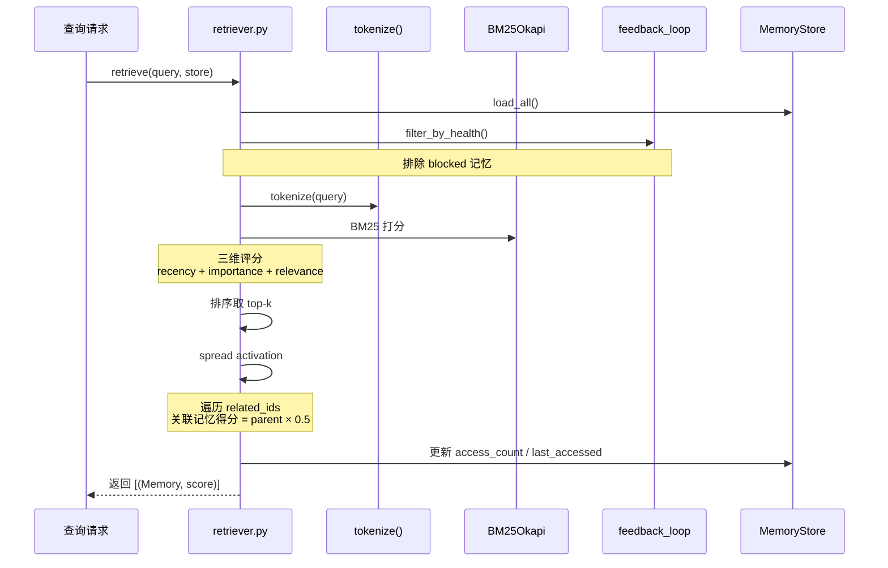
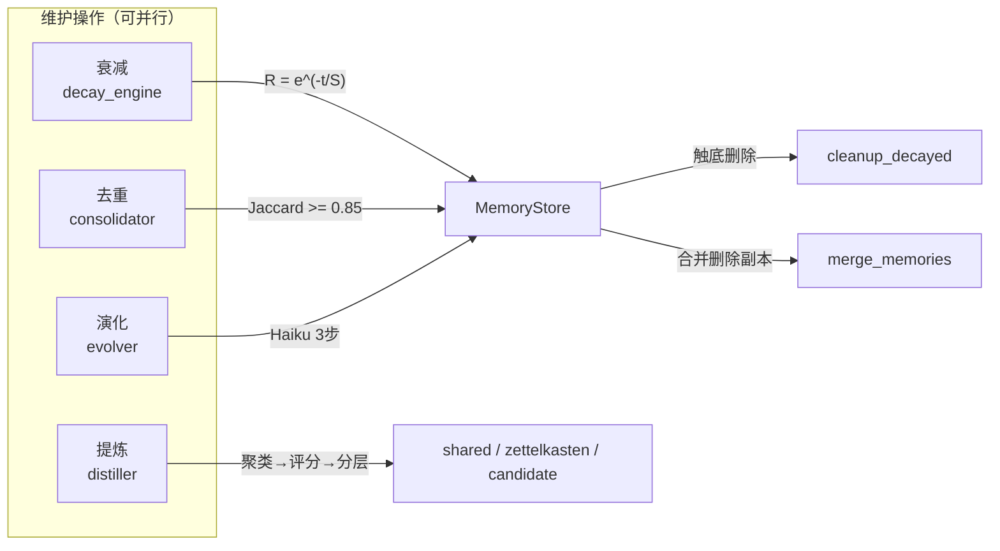
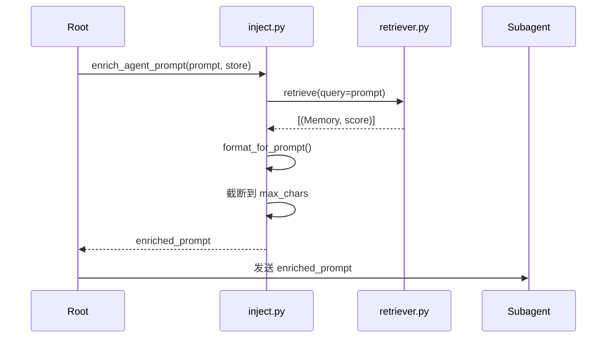

# Agent Memory System 运行架构

## 1. 系统概览

Agent Memory System 是一套基于 BM25 文本检索与三维评分模型的联想记忆系统，灵感源自 Stanford Generative Agents 论文的三维评分机制（recency + importance + relevance）、Ebbinghaus 遗忘曲线的记忆衰减模型、以及 A-MEM 论文的 Zettelkasten 关联链。系统为 9 个 subagent 和 1 个 root 协调器提供跨会话持久化记忆，支持自动关联、扩散激活检索、反馈学习、记忆衰减与知识提炼。

**系统规模**

| 指标 | 数值 |
|------|------|
| Python 脚本 | 14 个（~4980 行） |
| 测试文件 | 31 个（~15124 行） |
| 测试函数 | 613 个 |
| 记忆数据 | ~800 KB |
| Agent 记忆 | 9 角色 + root（共 69 条） |
| 工作流模板 | 13 个 |
| 执行记录 | 12 个 |

## 2. 架构层次图



## 3. 数据模型

### 3.1 Memory Dataclass（17 个字段）

| 分组 | 字段 | 类型 | 说明 |
|------|------|------|------|
| **标识** | `id` | `str` | 唯一标识，格式 `mem_YYYYMMDD_NNN` 或语义化 `{type}_{slug}` |
| | `name` | `str` | 人类可读短名 |
| | `description` | `str` | 一句话摘要 |
| | `type` | `str` | `user` / `feedback` / `task` / `knowledge` / `project` / `reference` |
| **内容** | `content` | `str` | 记忆正文（存为 Markdown body） |
| | `keywords` | `list[str]` | >= 3 个关键词，按重要性排序 |
| | `tags` | `list[str]` | 分类标签 |
| | `context` | `str` | 一句话语境摘要 |
| **评分** | `importance` | `int` | 重要性 1-10（Generative Agents 风格） |
| | `access_count` | `int` | 访问次数（Active Recall） |
| | `last_accessed` | `str?` | ISO 格式上次访问时间 |
| **反馈** | `positive_feedback` | `int` | 正面反馈计数 |
| | `negative_feedback` | `int` | 负面反馈计数 |
| **社交** | `owner` | `str` | 所属角色名（如 `kaze`） |
| | `scope` | `str` | `personal` / `shared` |
| | `accessed_by` | `list` | 哪些角色检索过此记忆 |
| **演化** | `related_ids` | `list[str]` | A-MEM 风格关联链 |
| | `evolution_history` | `list` | 演化更新历史（最多 10 条） |
| **时间戳** | `timestamp` | `str` | ISO 格式创建时间 |

### 3.2 存储格式

每条记忆存储为一个 `.md` 文件，使用 YAML Frontmatter + Markdown Body：

```markdown
---
id: task_修复latex编译错误
name: "修复 LaTeX 编译错误"
description: "fontspec 包加载失败的路径配置问题"
type: task
owner: tetsu
scope: personal
importance: 7
access_count: 2
last_accessed: "2026-03-11T14:00:00"
keywords:
  - LaTeX
  - fontspec
  - XeLaTeX
tags:
  - bug-fix
  - thesis
context: "论文编译中 XeLaTeX 引擎路径问题"
timestamp: "2026-03-10T10:00:00"
related:
  - "[[mem_20260310_002]]"
accessed_by: []
evolution_history: []
positive_feedback: 1
negative_feedback: 0
---

修复 LaTeX fontspec 编译错误，原因是 XeLaTeX 路径未正确配置。
解决方案：在 latexmkrc 中添加 -xelatex 参数。
```

### 3.3 文件命名规则

| 模式 | 示例 | 触发条件 |
|------|------|---------|
| 语义化 | `task_修复latex编译错误.md` | `name` 非空时优先使用 |
| 日期序列 | `mem_20260315_001.md` | 无 `name` 时按日期递增 |
| Agent 前缀 | `tetsu_20260315_001.md` | 指定 `agent_name` 时 |

## 4. 核心算法

### 4.1 三维评分模型

检索时对每条记忆计算三维评分，各维度归一化到 `[0, 1]` 后等权求和：

```
score = recency + importance_score + relevance
```

**Recency（时间衰减）**

$$R_{recency} = 0.995^{hours}$$

其中 `hours` 为距上次访问（或创建）的小时数。衰减因子 `0.995` 源自 Generative Agents 论文。

**Importance Score（改进版重要性）**

```
base         = importance / 10.0
recall_bonus = min(0.2, access_count × 0.02)           # Active Recall
feedback_adj = (ratio - 0.5) × confidence × 0.4        # Retrieval Feedback
score        = clamp(base + recall_bonus + feedback_adj, 0.0, 1.0)
```

其中：
- `ratio = positive / (positive + negative)`（无反馈时为 0.5）
- `confidence = min(1.0, total_feedback / 10)`
- feedback_adj 范围：`[-0.2, +0.2]`

**Relevance（BM25 相关度）**

使用 `rank-bm25` 库的 BM25Okapi 算法，语料为 `keywords + content + context + tags` 的拼接文本。分词器支持中英文混合（英文空白分词 + 中文逐字 + 二元组合词）。结果做 min-max 归一化到 `[0, 1]`。

### 4.2 Ebbinghaus 遗忘曲线

$$R = e^{-t/S}$$

其中：
- `t` = 距上次访问的天数
- `S` = `base_importance × 3 × feedback_factor`（stability 天数）

**Feedback 因子**（影响衰减速率）

| 反馈状态 | ratio 范围 | factor 范围 | 效果 |
|----------|-----------|-------------|------|
| 正面偏多 | (0.5, 1.0] | (1.0, 2.0] | 衰减减慢（最多 2x） |
| 无反馈/平衡 | 0.5 | 1.0 | 无影响 |
| 负面偏多 | [0.0, 0.5) | [0.5, 1.0) | 衰减加速（最多 2x） |

**衰减后 importance**

```
decayed = max(base × 0.2, base × R)
floor   = max(1, int(base × 0.2))    # 触底值
```

**清理规则**：衰减后 importance 触底（= floor）的记忆被删除。

### 4.3 反馈学习

**6 种反馈事件权重表**

| 事件 | delta_positive | delta_negative | 来源 |
|------|---------------|----------------|------|
| `task_success` | +1 | 0 | 自动推断 |
| `task_retry` | 0 | +1 | 自动推断 |
| `audit_pass` | +2 | 0 | 自动推断 |
| `audit_fail` | 0 | +2 | 自动推断 |
| `user_positive` | +3 | 0 | b1 手动 |
| `user_negative` | 0 | +3 | b1 手动 |

**健康状态机**

```
         total < 3
    ┌──────────────────┐
    │     healthy      │
    └──────────────────┘
            │
     ratio ≤ 0.4 且 neg ≥ 3
            ▼
    ┌──────────────────┐
    │     warning      │──── 检索降权 ×0.5，合并优先级降低
    └──────────────────┘
            │
     ratio ≤ 0.2 且 neg ≥ 5
            ▼
    ┌──────────────────┐
    │     blocked      │──── 完全排除检索/合并/演化
    └──────────────────┘
```

**渐进式升级（Escalation）**

| 同类负反馈次数 | 级别 | 动作 |
|--------------|------|------|
| 0 | none | 无 |
| 1-2 | downweight | importance 降低 30% |
| 3-4 | warning | 写入 `warnings/{pattern}.md` |
| >= 5 | block | 追加到 `blocked-paths.md` |

### 4.4 去重合并（Jaccard >= 0.85）

使用 `keywords + tags` 集合的 Jaccard 相似度：

$$J(A, B) = \frac{|A \cap B|}{|A \cup B|}$$

**合并策略**

| 字段 | 策略 |
|------|------|
| `keywords` / `tags` / `related_ids` | 并集（去重） |
| `importance` | 取较大值 |
| `content` | 保留较长者 |
| `access_count` / `positive_feedback` / `negative_feedback` | 累加 |
| `id` / `name` | 保留 primary 的值 |

**Primary 选择**：健康状态好的优先（healthy > warning）；健康相同时 importance 高的优先。两条都是 warning 不合并。

### 4.5 知识提炼（3 级置信度）

从多 agent 记忆中提炼可复用知识，无 LLM 依赖。

**流程**：收集候选记忆 → 贪心聚类（Jaccard >= 0.5）→ 分析 cluster → 置信度评分 → 分层输出

**置信度评分公式**

```
confidence = 0.30 × size_score       # cluster 大小 / 10
           + 0.30 × feedback_score    # 平均反馈质量
           + 0.25 × cross_agent       # 跨 agent 覆盖度 / 5
           + 0.15 × importance_score  # 平均 importance / 10
```

**输出分层**

| 置信度区间 | 目标 | 说明 |
|-----------|------|------|
| < 0.4 | `memory` → `~/mem/mem/shared/` | 低置信度，保存为共享记忆 |
| 0.4 - 0.7 | `zettelkasten` → Obsidian 笔记 | 中置信度，成为 Zettelkasten 笔记 |
| >= 0.7 | `candidate` → `~/mem/mem/distilled/` | 高置信度，候选 CLAUDE.md 规则 |

**知识类型判断**：feedback 类记忆为主 → rule；task 类记忆为主 → pattern；其他 → insight。

## 5. 存储拓扑



> 以上数值为文档创建时快照，实际数量随使用增长。
>
> 注：shared 记忆的代码默认路径为 ~/.claude/memory/shared，但逻辑上属于 ~/mem/mem/shared/ 体系。

**每个 Agent 目录结构**

```
agents/{Type}/{name}/
├── WhoAmI.md              # 角色身份定义（5 部分）
├── MEMORY.md              # 自动生成的记忆索引
├── trigger-map.md         # 角色级触发规则
├── profile.json           # 角色元数据
├── .index-meta.json       # 增量索引缓存
├── task_*.md              # task 类记忆
├── feedback_*.md          # feedback 类记忆
├── knowledge_*.md         # knowledge 类记忆
└── mem_YYYYMMDD_NNN.md    # 日期格式记忆
```

## 6. 决策链系统（Decision Chain）

### 6.1 标准决策链（6 Phase）



| Phase | 名称 | Agent | 说明 |
|-------|------|-------|------|
| 0 | 调研 | yomi | L0 快速扫描 / L1 标准调研 / L2 深度调研 |
| 1 | 探索 | kaze | 受调研结果引导，理解代码库现状 |
| 2 | 决策 | root | 综合调研+探索结果，制定计划，写入 `runs/` |
| 3 | 实现+文档 | tetsu + fumio | 并行执行，互不依赖 |
| 4 | 审计 | shin | 不可跳过，失败则返回 Phase 3 修复 |
| 5 | 提交 | tetsu | 审计通过后 git commit/push |

### 6.2 工作流模板体系

共 13 个模板（12 个 YAML + 1 个 Markdown），存放于 `~/mem/mem/workflows/templates/`：

| 模板名 | 用途 | 核心步骤 |
|--------|------|---------|
| `fix-chain` | 修复链 | fix → audit → docs → commit |
| `audit-chain` | 审计链 | CLAUDE.md 审计 → 修复 → 复审 → 提交 |
| `define-chain` | 定义链 | 角色定义 → 文档 → 提交 |
| `explore-chain` | 探索链 | 并行代码库探索 → 文档记录 |
| `feedback-chain` | 反馈链 | 反馈 → 吞食约束 → 文档 → 提交 |
| `memory-chain` | 记忆链 | 记忆提取 → 关联分析 → 索引生成 |
| `review-chain` | 审查链 | 并行代码审查 → 修复 → 复审 → 提交 |
| `thesis-chain` | 论文链 | 编辑 → 编译 → 审计 → 导出 → 提交 |
| `research-chain` | 调研链 | 外部三路并发调研 → 归档 |
| `research-decide-implement` | 复合链 | 调研 → 决策 → 实施（标准决策链完整实现） |
| `project-init-chain` | 项目初始化 | 创建项目 → 模板填充 → MOC 更新 → 提交 |
| `daily-close-chain` | 日终链 | 日记 → changelog → 提交 |
| `memory-change-sync` | 记忆同步 | agent-memory 变更 → fumio 更新项目主页 |

### 6.3 执行记录格式

每次决策链执行生成一个 Markdown 文件，存于 `~/mem/mem/workflows/runs/`：

**Frontmatter 字段**

| 字段 | 类型 | 说明 |
|------|------|------|
| `workflow` | `str` | 使用的模板名 |
| `task` | `str` | 一句话任务描述 |
| `date` | `str` | 日期 YYYY-MM-DD |
| `decision` | `str` | 最终决策和理由 |
| `skip_reason` | `str` | 跳过的步骤及原因，无跳步写 `none` |
| `score` | `int` | 路径效率评分（反馈学习累积） |

**Phase 表格**

```markdown
| Phase | 名称 | Agent | 状态 | 输出摘要 |
|-------|------|-------|------|---------|
| 0 | 调研 | yomi | completed | 发现 3 个改进点 |
| 1 | 探索 | kaze | completed | 确认 5 个相关文件 |
| 2 | 决策 | root | completed | 分 3 阶段实施 |
| 3 | 实现 | tetsu | completed | 新增 200 行代码 |
| 4 | 审计 | shin | completed | 通过，无 issue |
| 5 | 提交 | tetsu | completed | commit abc1234 |
```

**状态值**：`pending` / `in_progress` / `completed` / `skipped` / `paused` / `failed`

### 6.4 Mission Mode（全自主执行）

**触发条件**：b1 发出一句高层目标（如"审计 X"、"重构 Y"），root 自主推进全链路。

**自主决策树**



**失败自恢复**

```
失败 → 自主分析原因 → 换策略重试（最多 2 次）
         ↓ 仍失败
    降级处理（简化任务范围）
         ↓ 仍失败
    仅不可逆失败 → 上报 b1
```

### 6.5 工作流模板结构

模板使用 YAML 格式，支持以下特性：

**步骤依赖**（`depends_on`）：声明步骤间的依赖关系，自动确定执行顺序。步骤调度使用 Kahn 拓扑排序确定执行顺序，无依赖步骤并行调度。

**并行调度**（`parallel: true`）：无依赖的步骤并行执行。

**失败策略**（按优先级）：

| 策略 | 关键字 | 说明 |
|------|--------|------|
| retry | `retry.max_attempts` | 重试 N 次 |
| goto | `on_failure.goto` | 跳转到指定步骤重做 |
| pause | `on_failure: pause` | 暂停等待干预 |
| skip | `on_failure: skip` | 跳过当前步骤 |
| abort | `on_failure: abort` | 终止整个工作流 |

**模板示例**（fix-chain 简化）：

```yaml
name: fix-chain
steps:
  - id: fix
    agent: tetsu
    retry: { max_attempts: 2, on_failure: pause }
  - id: audit
    agent: shin
    depends_on: [fix]
    on_failure: { goto: fix, max_loops: 2 }
  - id: docs
    agent: fumio
    depends_on: [audit]
  - id: commit
    agent: tetsu
    depends_on: [docs]
```

## 7. 数据流图

### 7.1 写入流



### 7.2 检索流



### 7.3 维护流



### 7.4 注入流



## 8. 集成点

### 8.1 Hooks 集成

| Hook | 脚本 | 集成方式 |
|------|------|---------|
| PostToolUse/Agent | `post-agent-memory-reminder.py` | Agent 完成后提醒 root 保存记忆 |
| Stop | `post-agent-memory-reminder.py` | 双触发源：确保记忆不丢失 |

### 8.2 Registry 集成

`registry.py` 管理角色的分配与状态：

- **registry.json**：角色注册表（name → type + status + created）
- **names.json**：名字池管理（available / used）
- 9 种角色类型，其中 4 种为 Singleton（Raiga、Fumio、Norna、Yume）

### 8.3 Obsidian 导出

`obsidian_export.py` 将记忆导出为 Obsidian 笔记：
- 单条记忆 → 带 frontmatter 的 `.md` 笔记
- MOC 索引 → `_agent_memory_moc.md`（含 Dataview 查询）
- 关联图谱 → `memory_graph.md`（Mermaid 图，按 importance 着色）

### 8.4 触发效率追踪

`trigger_tracker.py` + `trigger-stats.json`：

- 记录每条规则的触发结果（success / failure / skip）
- 自动计算效率 = success / (success + failure)
- 动态调整权重：效率 > 80% 升权，< 40% 降权，< 20% 建议禁用
- 权重范围 `[0.3, 1.5]`

## 9. 角色与记忆隔离

### 9.1 角色表

| 角色 | 类型 | 记忆路径 | 当前记忆数 |
|------|------|---------|-----------|
| kaze | Explore | `agents/Explore/kaze/` | 4 |
| tetsu | Worker | `agents/Worker/tetsu/` | 5 |
| shin | Auditor | `agents/Auditor/shin/` | 2 |
| yomi | Analyst | `agents/Analyst/yomi/` | 5 |
| haku | Inspector | `agents/Inspector/haku/` | 2 |
| raiga | Devourer | `agents/Devourer/raiga/` | 2 |
| fumio | Weaver | `agents/Weaver/fumio/` | 6 |
| norna | Matrix | `agents/Matrix/norna/` | 3 |
| yume | Dreamer | `agents/Dreamer/yume/` | 4 |
| root | (coordinator) | `root/` | 56 |

> 以上数值为文档创建时快照，实际数量随使用增长。

### 9.2 WhoAmI.md 结构（5 部分）

每个角色的 `WhoAmI.md` 包含：

1. **我是谁**：名称、代号、类型、模型
2. **我的工作范围**：职责定义
3. **工具权限**：Read / Write / Edit / Bash / Glob / Grep（按角色不同）
4. **越权拒绝规则**：超出范围的任务应拒绝并推荐正确角色
5. **任务完成收尾**：强制保存记忆的 CLI 命令模板

### 9.3 跨 Agent 检索机制

三种检索模式：

| 模式 | 触发方式 | 搜索范围 |
|------|---------|---------|
| 个人检索 | 默认 | 仅当前 agent 的 store |
| 合并检索 | `--agent` 参数 | 个人 + 同类型其他角色 + shared |
| 跨 Agent 检索 | `--cross-agent` | 扫描所有 `~/mem/mem/agents/*/` |

**晋升机制**：当一条记忆被 >= 3 个不同角色检索过时，自动复制到 `shared/` 层。

## 10. SSOT 约束

| 信息类型 | 权威文件 | 禁止写入 |
|----------|---------|---------|
| 工作流模板 | `~/mem/mem/workflows/templates/*.yaml` | SKILL.md 中 |
| 工作流状态 | `~/mem/mem/workflows/runs/*.md` | 模板中 |
| Agent 记忆 | `~/mem/mem/agents/{Type}/{name}/` | auto-memory 中 |
| 角色注册表 | `~/.claude/memory/registry.json` | CLAUDE.md 中硬编码 |
| 触发统计 | `~/mem/mem/workflows/trigger-stats.json` | 其他位置 |

## 11. 关键常数汇总表

| 常数 | 值 | 所在模块 | 说明 |
|------|-----|---------|------|
| **检索相关** | | | |
| `decay_factor` | 0.995 | retriever.py | Recency 时间衰减因子 |
| `spread_decay` | 0.5 | retriever.py | 扩散激活衰减系数 |
| `LOW_RELEVANCE_THRESHOLD` | 2.4 | retriever.py | 低相关度警告阈值 |
| `max_chars` | 2000 | inject.py | Prompt 注入最大字符数 |
| **衰减相关** | | | |
| `stability_multiplier` | 3.0 | decay_engine.py | S = importance × 3 天 |
| `floor_ratio` | 0.2 | decay_engine.py | 触底比例（最低保留 20%） |
| `feedback_factor_max` | 2.0 | decay_engine.py | 正面反馈最大减慢因子 |
| `feedback_factor_min` | 0.5 | decay_engine.py | 负面反馈最大加速因子 |
| **合并相关** | | | |
| `consolidation_threshold` | 0.85 | consolidator.py | Jaccard 合并阈值 |
| `distill_cluster_threshold` | 0.5 | distiller.py | 聚类 Jaccard 阈值 |
| `distill_dedup_threshold` | 0.9 | distiller.py | 提炼前去重阈值 |
| `min_cluster_size` | 3 | distiller.py | 最小 cluster 大小 |
| `retention_threshold` | 0.3 | distiller.py | 候选记忆最低 retention |
| **反馈相关** | | | |
| `warning_ratio` | 0.4 | feedback_loop.py | Warning 健康阈值 |
| `warning_min_neg` | 3 | feedback_loop.py | Warning 最低负面数 |
| `blocked_ratio` | 0.2 | feedback_loop.py | Blocked 健康阈值 |
| `blocked_min_neg` | 5 | feedback_loop.py | Blocked 最低负面数 |
| **演化相关** | | | |
| `MAX_EVOLUTION_HISTORY` | 10 | evolver.py | 演化历史最大条数 |
| `_POSITIVE_RATIO_THRESHOLD` | 0.7 | evolver.py | 正面反馈 boost 阈值 |
| `_IMPORTANCE_BOOST` | 1 | evolver.py | 正面反馈 importance 提升 |
| `_MAX_IMPORTANCE` | 10 | evolver.py | Importance 上限 |
| **触发追踪** | | | |
| `WEIGHT_CEILING` | 1.5 | trigger_tracker.py | 触发权重上限 |
| `WEIGHT_FLOOR` | 0.3 | trigger_tracker.py | 触发权重下限 |
| `EFFICIENCY_HIGH` | 0.8 | trigger_tracker.py | 高效率阈值（升权） |
| `EFFICIENCY_LOW` | 0.4 | trigger_tracker.py | 低效率阈值（降权） |
| `EFFICIENCY_DISABLE` | 0.2 | trigger_tracker.py | 建议禁用阈值 |
| `DISABLE_MIN_TRIGGERS` | 5 | trigger_tracker.py | 禁用最低触发次数 |
| **关联相关** | | | |
| `association_threshold` | 0.3 | associator.py | BM25 关联阈值 |
| `association_top_k` | 5 | associator.py | 关联候选数 |
| **晋升相关** | | | |
| `promotion_threshold` | 3 | memory_store.py | 跨角色访问 >= 3 次晋升 shared |
| **提炼输出** | | | |
| `confidence_low` | 0.4 | distiller.py | 低置信度（→ memory） |
| `confidence_high` | 0.7 | distiller.py | 高置信度（→ candidate） |
